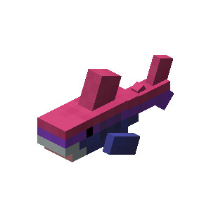
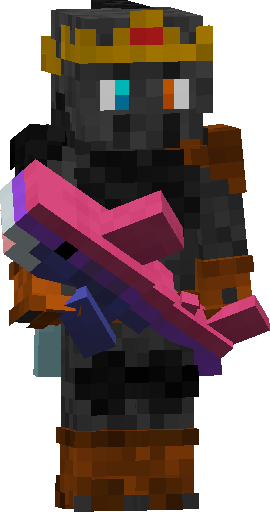
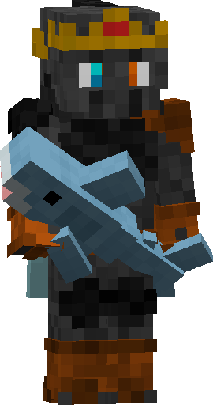

# Blahaj

## Crafting

{{ crafting(
    slots = [
        "", "A", "",
        "A", "A", "A",
        "C", "B", ""
    ],
    ingredients = {
        "A": {"name": "Light Blue Wool", "img": "Light_Blue_Wool.png"},
        "B": {"name": "White Wool", "img": "White_Wool.png"},
        "C": {"name": "Pink Dye", "img": "pink_dye.png"}
    },
    result = {"name": "Blahaj", "img": "Blue_Shark.png"}
) }}

This recipe gives you the basic blahaj.

## Use

There exists many versions of the blahaj (bi, trans, gay, ...).
You can get all of them without any extra items, just palce the blahaj in the stonecutter and choose the option (stonecutter shows you all options that exist) you want.

You can reverse this too by just placing the changed blahaj in the crafting table without anything else and you will get the basic blahaj back.

**Bi Blahaj for example:** 

## Reversing example

{{ crafting(
    slots = [
        "", "", "",
        "", "A", "",
        "", "", ""
    ],
    ingredients = {
        "A": {"name": "Bi Blahaj", "img": "Bi_Shark.png"}
    },
    result = {"name": "Blahaj", "img": "Blue_Shark.png"}
) }}

 

