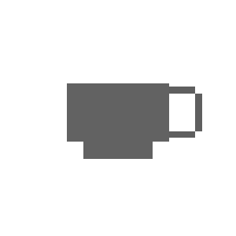

# Consumables

## Use

You can use the consumables like normal Items with a right-click.
They often give you some special effects, that you will need to find out yourself.
The Item probably will also not lose any durability and just be gone.

## Crafting

### Black Coffee 

{{ crafting(
    slots = [
        "", "", "",
        "A", "B", "C",
        "", "D", ""
    ],
    ingredients = {
        "A": {"name": "Sugar", "img": "sugar.png"},
        "B": {"name": "Cocoa Beans", "img": "cocoa_beans.png"},
        "C": {"name": "Milk bucket", "img": "milk_bucket.png"},
        "D": {"name": "Empty Glass Bottle", "img": "glass_bottle.png"}
    },
    result = {"name": "Black Coffee", "img": "Black_coffee.png"}
) }}
