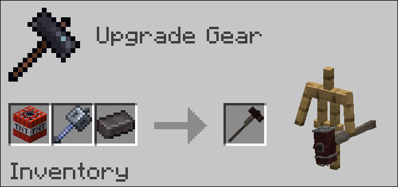
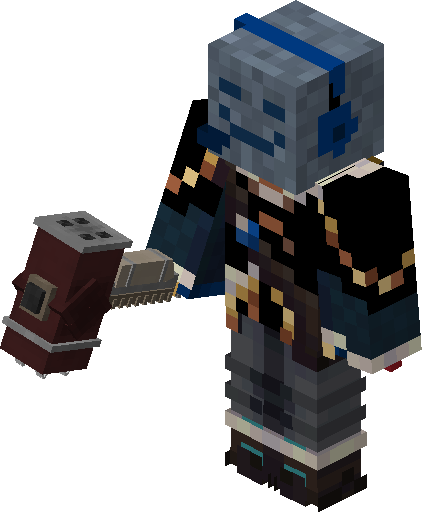
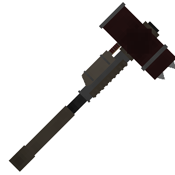

# Decimator

## Work in Progress

It is still not done, but feel free to use it as it is at the moment.
**Can be severely broken at the moment**

## INFO

The Decimator is a retextured Mace, that has more durability, can't be broken by fire and deals more damage.
It also does a bit of aoe damage to all entities nearby (max 5).

## Crafting

Can be "crafted" upgraded in the Smithing Table by using a mace, netherite ingot and a TNT Block.

   

