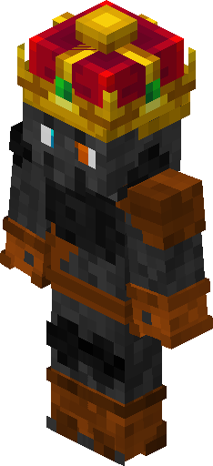

# Crown

## Background

Made for the one and only King - **King Goose of Pub²**.

## Crafting

{{ crafting(
    slots = [
        "", "", "",
        "D", "", "D",
        "D", "A", "D"
    ],
    ingredients = {
        "A": {"name": "Golden Helmet", "img": "golden_helmet.png"},
        "D": {"name": "Gold Ingot", "img": "gold_ingot.png"}
    },
    result = {"name": "Crown", "img": "Crown.png"}
) }}

## Can be put on

* Helmets (all except turtle)

