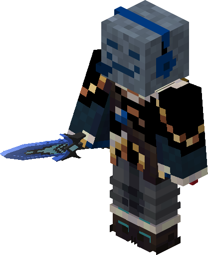

# Frostfang

## Crafting

{{ crafting(
  slots = [
        "", "", "",
        "", "A", "",
        "", "B", ""
    ],
    ingredients = {
        "B": {"name": "Stick", "img": "stick.png"},
        "A": {"name": "Wheat", "img": "diamond.png"}
    },
    result = {"name": "Frostfang Skin", "img": "Frostfang_Skin.png"}
) }}

## Can be put on

* all swords

