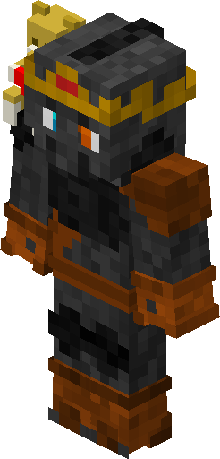

# Teddy (Skin)

## Crafting

{{ crafting(
    slots = [
        "A", "B", "",
        "", "", "",
        "", "", ""
    ],
    ingredients = {
        "A": {"name": "Stick", "img": "stick.png"},
        "B": {"name": "Teddy", "img": "Teddy_Skin.png"}
    },
    result = {"name": "Teddy Skin", "img": "Teddy_Skin.png"}
) }}

> **Note:** these are two different Teddys, the first one you need for crafting is the actual teddy (the one you can place and use as decoration) and the second one is the result (looks absolutely the same, because it is, it just can't be placed and instead be put on as a skin).

## Can be put on

* Helmets (all except turtle)
* Totem of Undying

## How it looks put on the helmet

